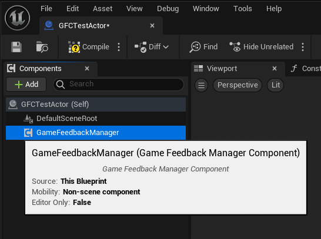
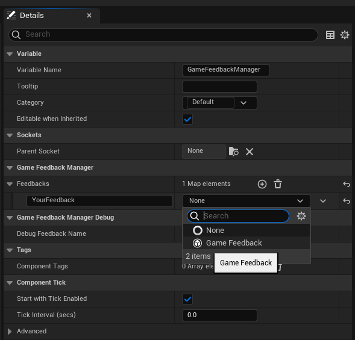
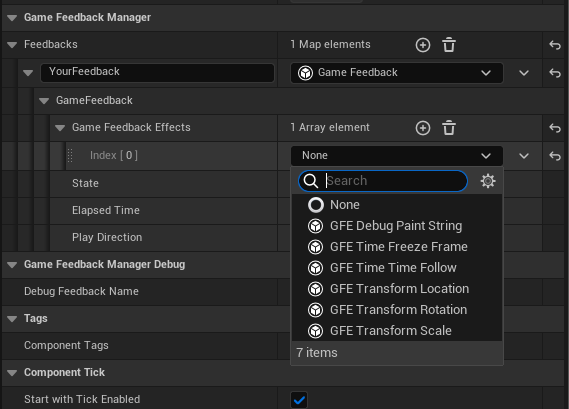
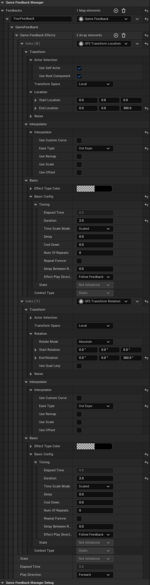
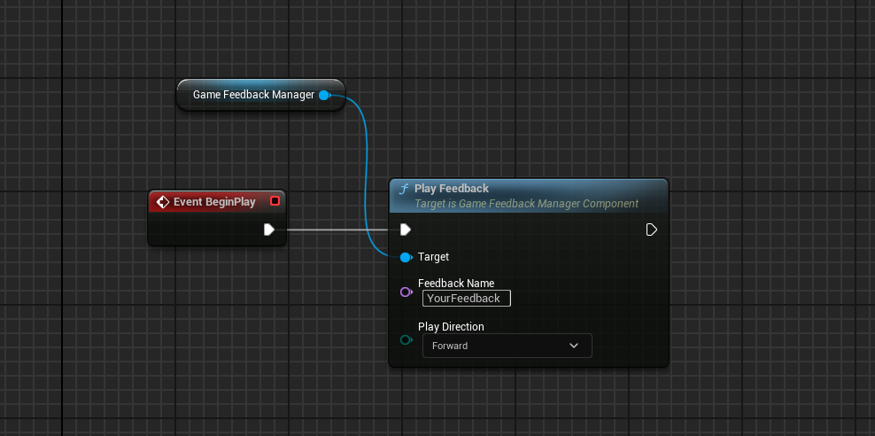
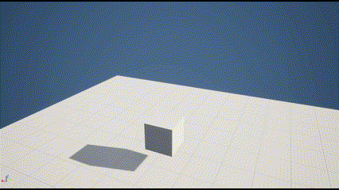
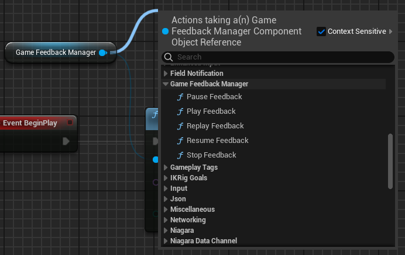
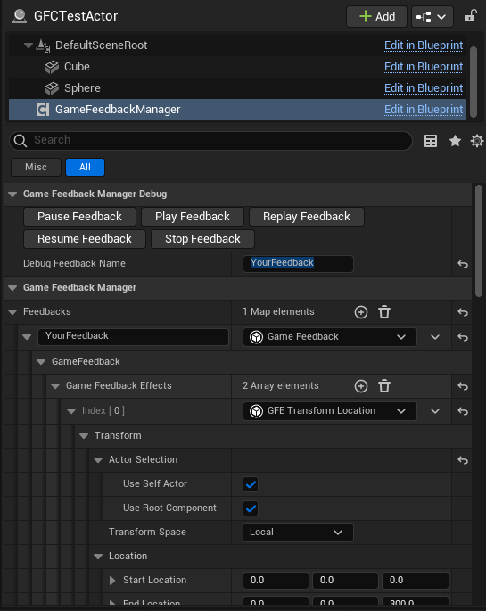
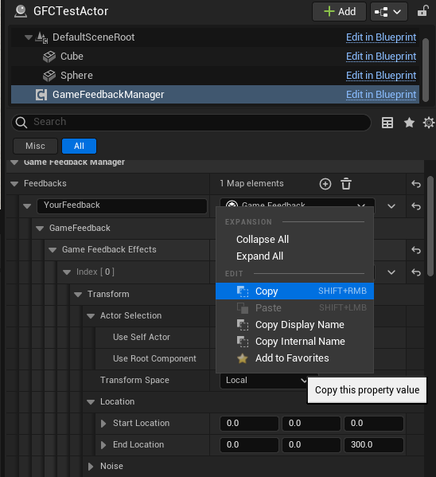

# GameFeedbackCrafter

GameFeedbackCrafter是一个模块化的效果制作插件，它使你能够快速迭代和处理复杂的游戏表现。

GameFeedbackCrafter将一个复杂游戏效果抽象为一个**GameFeedback**，一个GameFeedback由多个**GameFeedbackEffect**组成。GameFeedback不提供任何效果，它仅负责组织和维护GameFeedbackEffect，而实际的效果逻辑则是在GameFeedbackEffect中实现。这使我们能够将大量的游戏效果拆分成一个个GameFeedbackEffect模块，并在GameFeedback中根据实际需求组合他们，以此快速实现和迭代复杂的游戏效果。具体核心库介绍详见文档[GameFeedbackCore](doc/Language/Chinese/GameFeedbackCore-zh.md)。

插件将内置一个自带的效果模块库，它将随着项目的发展不断增大。具体的模块文档详见[目录](doc/GameFeedbackEffectIndex.md)。

项目仍处于研发阶段，不过核心框架现已完成，如果您想对插件做出贡献，欢迎您的PR！我将不胜感激！

此外，目前插件的编辑器体验较为原始，我将优先完成插件的逻辑功能。

## 快速上手
---
1. 添加GameFeedbackManagerComponent

	
 2. 在Feedbacks字典内添加你的自定义GameFeedback

	 

	字典的Key是Feedback的名字，GameFeedbackManagerComponent靠这个Key来索引Feedback，这里设计为用FName来索引，有支持第三方脚本语言的考虑，如AngelScript等。
3. 配置自定义GameFeedbackEffect，你可以随意设计你的效果。

	

	以下为一个简单的例子，组件所附加的Actor将在播放Feedback的时候，基于本地坐标系，在两秒内向上移动300单位，同时在Z轴上旋转360度。两者都使用了Out Expo插值。
	
	

4. 播放GameFeedback
	获取到GameFeedbackManagerComponent的引用，并调用其PlayFeedback函数即可。
	
	
	
	播放上面例子的效果：

	
	
	GameFeedbackManagerComponent也提供其他的控制函数，使用上也和PlayFeedback一样简单，只需指定要操作的Feedback Name即可。

	
	
	另外，你也可以直接在运行时迭代效果，填写要Debug的Feedback名字，并点击编辑器中的控制按钮即可。你可以在运行时任意编辑Feedbacks数组里面的任何内容，并且无需退出运行即可看到修改效果（利用Debug菜单）

	
	
	注意！Unreal并不会自动保存在运行期间做出的任何修改！但是，你可以通过直接复制运行时迭代好效果，再手动粘贴到默认蓝图中。可以复制GFE，也可以是一个GF，必要情况下，复制整个Feedbacks数组都行。

	
## 拓展GameFeedbackEffect
---
插件自带的GFE库都在GameFeedbackEffect模块当中，如果你想帮忙贡献路线图上的效果，请在GameFeedbackEffect模块中对应类型的目录内进行。

要拓展您的自定义GFE，只需继承UGameFeedbackEffectBase类并重写生命周期函数即可，具体可见[GameFeedbackCore](doc/Language/Chinese/GameFeedbackCore-zh.md)。一个易于参考的例子是[UGFE_Debug_PaintString](Source/GameFeedbackEffect/Public/DebugEffect/GFE_Debug_PaintString.h)。但是，比起直接继承UGameFeedbackEffectBase，在部分情况下继承插件本身提供的通用GFE基类可能更方便，比如维护着一个插值器的UGFE_InterpolatorGameFeedbackEffectBase，它可以让子类方便的使用该插值器，为子类提供播放进度插值的功能，具体的例子可以见[GFE_Transform](Source/GameFeedbackEffect/Public/Transform/GFE_Transform.h)的实现。

插件也提供了通用的工具结构体，除了上面的插值器之外，也有Actor选择器、噪波生成器等等。像这种通用的工具结构体也会在未来不断扩充。