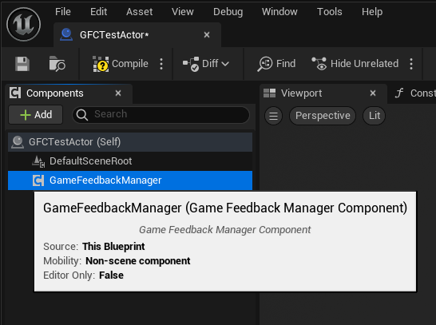
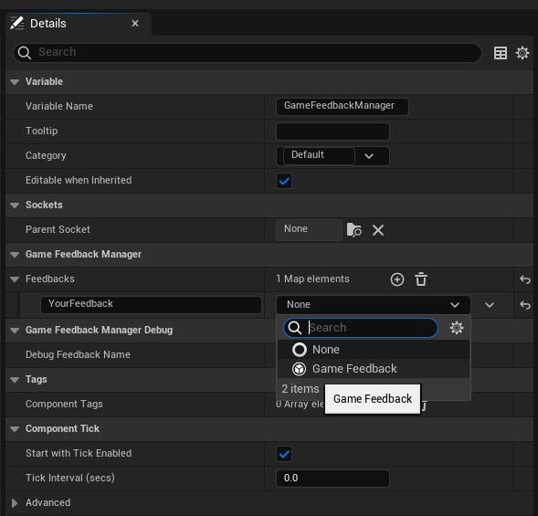
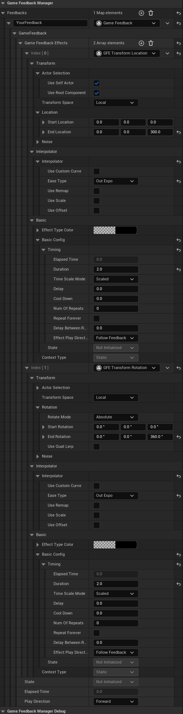
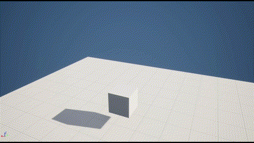
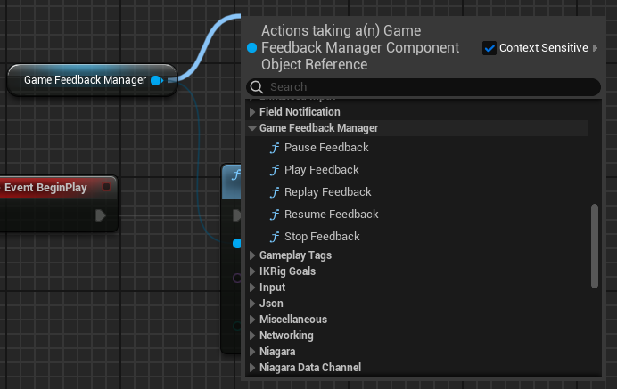

# GameFeedbackCrafter
> Language: [Chinese](README-zh.md)

GameFeedbackCrafter is a modular effect creation plugin that enables you to quickly iterate and work with complex game performance.

GameFeedbackCrafter abstracts a complex game effect into a **GameFeedback**, which consists of multiple **GameFeedbackEffects** GameFeedback doesn't provide any effects, it only organizes and maintains the GameFeedbackEffect, while the actual effect logic is implemented in GameFeedbackEffect. This allows us to split a large number of game effects into individual GameFeedbackEffect modules, and combine them in GameFeedback according to actual needs, so as to quickly realize and iterate complex game effects. See [GameFeedbackCore](doc/GameFeedbackCore.md) for a detailed description of the core library.

The plugin will come with a built-in library of effect modules that will grow as the project develops. Specific module documentation is detailed in [catalog](doc/GameFeedbackEffectIndex.md).

The project is still in the development stage, but the core framework is now complete, so if you would like to contribute to the plugin, I would appreciate your PR!

Additionally, the plugin's editor experience is currently rather primitive, and I will prioritize completing the plugin's logic features.

## Quick start.
---
1. Add GameFeedbackManagerComponent

	

 2. Add your custom GameFeedback to the Feedbacks dictionary.

	 

	The Key of the dictionary is the name of the Feedback, GameFeedbackManagerComponent relies on this Key to index the Feedback, which is designed to be indexed by FName, with the consideration of supporting third-party scripting languages, such as AngelScript.
3. Configure a custom GameFeedbackEffect and you can design your effect however you like.

	

	Below is a simple example where the Actor attached to the component will move up 300 units in two seconds based on the local coordinate system while playing Feedback, while rotating 360 degrees on the Z axis. Both use Out Expo interpolation.
	
	

4. Play GameFeedback
	Just get a reference to the GameFeedbackManagerComponent and call its PlayFeedback function.
	
	
	
	Play the effect of the above example:

	
	
	GameFeedbackManagerComponent also provides other control functions, the use of which is as simple as PlayFeedback, just specify the name of the feedback you want to operate.

	
	
	Alternatively, you can iterate through the effects directly at runtime by filling in the name of the Feedback you want to Debug and clicking the control button in the editor. You can edit anything in the Feedbacks array at runtime and see the effect of the changes without having to exit the run (using the Debug menu).

	
	
	Note! Unreal does not automatically save any changes made during runtime! However, you can iterate through the runtime good effects by copying them directly and then manually pasting them into the default blueprint. This can be done by copying the GFE, or a GF, or if necessary, the entire Feedbacks array.

	
## Expanding the GameFeedbackEffect
---
The GFE libraries that come with the plugin are among the GameFeedbackEffect module, if you want to help contribute to the effects on the roadmap, please do so within the corresponding type of directory in the GameFeedbackEffect module.

To extend your custom GFE, simply inherit from the UGameFeedbackEffectBase class and override the lifecycle functions, as seen in [GameFeedbackCore](doc/GameFeedbackCore.md). An easy to reference example is [UGFE_Debug_PaintString](Source/GameFeedbackEffect/Public/DebugEffect/GFE_Debug_PaintString.h). However, rather than directly inheriting from UGameFeedbackEffectBase, it may be more convenient in some cases to inherit from the generic GFE base class provided by the plugin itself, such as UGFE_InterpolatorGameFeedbackEffectBase which maintains an interpolator, which can be conveniently used by subclasses for the subclasses to provide playback progress interpolation, see the implementation of [GFE_Transform](Source/GameFeedbackEffect/Public/Transform/GFE_Transform.h) for a concrete example.

The plugin also provides generic tool structures, besides the interpolator above, there are also Actor selectors, noise generators and so on. Generic tool structures like this will also be expanded in the future.