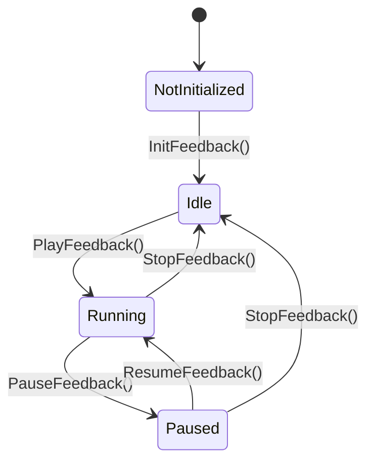
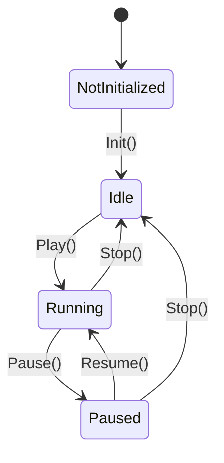

>Language: [Chinese](doc/Language/Chinese/GameFeedbackCore-zh)
 
The core part of the GameFeedback framework consists of two main parts, the core library and the general tools library.

## Core library
The core library contains the three most important classes of the framework:
- [GameFeedback](#GameFeedback)
- [GameFeedbackEffect](#GameFeedbackEffect)
- [GameFeedbackPlayer](#GameFeedbackPlayer)

## GameFeedback
```cpp
UCLASS(BlueprintType, Blueprintable, EditInlineNew)
class GAMEFEEDBACKCORE_API UGameFeedback : public UObject
{
GENERATED_BODY()
///...
}
```
The GameFeedback class is mainly responsible for effect assembly. Each GameFeedback object maintains a list of GameFeedbackEffects, GameFeedback itself does not have any actual effects attached to it, all the effects are realized by the GameFeedbackEffect object, which is just a state machine responsible for scheduling and updating the GameFeedbackEffect objects it maintains. GameFeedback is just a state machine responsible for scheduling and updating the GameFeedbackEffect objects it maintains.
##### Life Cycle
The GameFeedback object has a total of four states, namely:
- NotInitialized,
- Idle
- Running
- Paused

Where the transitions between states are related as shown below:

##### Events
GameFeedback objects trigger events when their state changes, and these events can be listened to and handled by the bound GameFeedbackPlayer.

Generally, these events are used internally by the plugin, so users don't need to pay attention to them, but if there are some special needs, you can listen to them and handle them by yourself.
###### OnGameFeedbackStateChanged
```cpp
DECLARE_DYNAMIC_MULTICAST_DELEGATE_OneParam(FOnGameFeedbackStateChanged, EGameFeedbackState, NewState);

UPROPERTY(BlueprintAssignable, Category = "GameFeedback")
FOnGameFeedbackStateChanged OnGameFeedbackStateChanged;
```
This event is broadcast when the GameFeedback's own state changes, the event will broadcast the current state of the GameFeedback.
###### OnGameFeedbackStopped
```cpp
DECLARE_DYNAMIC_MULTICAST_DELEGATE_OneParam(FOnGameFeedbackStopped, bool, bInterrupted);

UPROPERTY(BlueprintAssignable, Category = "GameFeedback")
FOnGameFeedbackStopped OnGameFeedbackStopped;
```
This event is broadcast when the GameFeedback stops, notably it will be broadcast before the OnGameFeedbackStateChanged event, which broadcasts whether or not the current GameFeedback stoppage is part of an interrupted situation.
##### Main Functions
```cpp
void InitFeedback();;
void PlayFeedback();
void PauseFeedback(); void ResumeFeedback()
void ResumeFeedback();
void StopFeedback(); void TickFeedback(float)
void TickFeedback(float DeltaTime).
```
###### InitFeedback()
Used to initialize GameFeedback, in addition to setting its own state, the function will iterate through the GameFeedbackEffect it maintains and call the GameFeedbackEffect's initialization function.
###### PlayFeedback()
Used to play GameFeedback, after calling, Feedback will mark itself as Running, but it doesn't have the ability to Tick itself, the Tick of Feedback needs to be done by its bound GameFeedbackPlayer.

GameFeedback implements event-driven, and only notifies its bound GameFeedbackPlayer when its state changes.The function to set the state is as follows:
```cpp
void UGameFeedback::SetState(const EGameFeedbackState NewState)
{
    if (State ! = NewState)
    {
State = NewState.
OnGameFeedbackStateChanged.Broadcast(State);
    }
}
```
###### PauseFeedback()
Pause the GameFeedback in play, this method also only marks itself as paused, and iterates through the GameFeedbackEffect it maintains to call its pause method, it doesn't have the ability to pause the Tick itself. Including the later ResumeFeedback() method, it only changes its own state and broadcasts the state change event, the specific Tick-related transactions will be maintained by the GameFeedbackPlayer it is bound to.
###### ResumeFeedback()
Resume the paused GameFeedback, same principle as above.
###### StopFeedback()
Stop GameFeedback, this function has two kinds of calls, one is maintained by GameFeedback, when all the maintained GameFeedbackEffects are finished, it will be called automatically, at this time, GameFeedback is a normal execution of the completion of the stop, rather than being interrupted.

When the GameFeedback is still in Running or Paused state, and the user calls the StopFeedback() method by himself, the current Feedback will be forcibly terminated, and will be marked as an interrupted stop operation.The GameFeedbackEffect can get the state of whether the stop operation is interrupted or not and GameFeedbackEffect can find out if the stop is interrupted and handle it differently. Using this we can ensure that the interruption of the effect is safe and accurate.
###### TickFeedback(float DeltaTime)
GameFeedback's tick function, called and maintained by GameFeedbackPlayer, should not be called by the user.

This Tick function is responsible for updating GameFeedbackEffect and maintaining GameFeedback's own state, in each Tick, GameFeedback will call GameFeedbackEffect's Tick function one by one in the order of GameFeedbackEffect list. GameFeedbackEffect also has its own state, when all GameFeedbackEffects have finished playing, GameFeedback will end automatically.

The Tick order of GameFeedbackEffect has no priority, this is designed to make the design logic of the effect more intuitive and unified, the execution of the effect is always executed from top to bottom, and there is no jumping order of execution.

## GameFeedbackEffect
```cpp
UCLASS(Abstract, EditInlineNew, AutoExpandCategories=(Basic))
class GAMEFEEDBACKCORE_API UGameFeedbackEffectBase : public UObject
{
    GENERATED_BODY()
    ///...
}
```
The GameFeedbackEffect class handles the actual effect logic, and these are implemented by subclasses, which define the specific behavior. For a subclass that inherits the GameFeedbackEffect class, the functions to be concerned with are as follows:
```cpp
// Life cycle
virtual void OnInit() {}
virtual void OnPlay() {}
virtual void OnPause() {}
virtual void OnResume() {}
virtual void OnStop(bool bInterrupted) {}
virtual void OnTick(float DeltaTime) {}

// Editor
virtual EGameFeedbackEffectType GetEffectType() const
GetEffectType() const
    return EGameFeedbackEffectType::Custom; }
}
```
The above lifecycle callback names basically clarify their respective functions, and subclasses can override these dummy functions and insert their own effect logic.The state of GameFeedbackEffect is basically the same as GameFeedback, because GameFeedback actually does a bit of forwarding. The following is the state diagram of GameFeedbackEffect:

The GameFeedbackEffect class declares an `EGameFeedbackEffectType GetEffectType()` function, which returns an `EGameFeedbackEffectType` enumeration that defines the GameFeedbackEffect's This enumeration is for editor use only, and is mainly used as a marker for the custom attribute editor (which has not yet been implemented).
## GameFeedbackPlayer
```cpp
UCLASS()
class GAMEFEEDBACKCORE_API UGameFeedbackPlayer : public UObject, public FTickableGameObject
{
    GENERATED_BODY()
}
```
The GameFeedbackPlayer class is responsible for handling GameFeedback, and it implements FTickableGameObject with Tick functionality.

To play a GameFeedback, you first need to create a GameFeedbackPlayer object and call the LoadFeedback method of the Player object, and then call the Player's PlayerFeedback function after Load is complete. The related functions are as follows:
```cpp
public.
UFUNCTION(BlueprintCallable, Category = "GameFeedbackPlayer")
void LoadFeedback(UGameFeedback* Feedback).

UFUNCTION(BlueprintCallable, Category = "GameFeedbackPlayer")
void PlayFeedback(bool bUseAutoUnload = false);
```
In addition, GameFeedbackPlayer also provides methods for controlling GameFeedback, users should not directly call methods in GameFeedback, but should always use GameFeedbackPlayer to manipulate GameFeedback.
```cpp
UFUNCTION(BlueprintCallable, Category = "GameFeedbackPlayer")
void PauseFeedback() const;

UFUNCTION(BlueprintCallable, Category = "GameFeedbackPlayer")
void ResumeFeedback() const;

UFUNCTION(BlueprintCallable, Category = "GameFeedbackPlayer")
void StopFeedback() const;

UFUNCTION(BlueprintCallable, Category = "GameFeedbackPlayer")
void ReplayFeedback() const;

UFUNCTION(BlueprintCallable, Category = "GameFeedbackPlayer")
void UnloadFeedback();
```